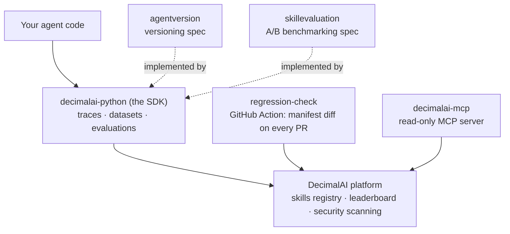

# DecimalAI

**Catch agent regressions before they ship, and measure agent skills with an open A/B spec — instead of trusting a download count.**

### Which repo do you want?

| You want to… | Go to |
|---|---|
| Trace your agent, catch regressions, measure your skills | [decimalai-python](https://github.com/decimal-labs/decimalai-python) |
| Read the agent-versioning spec | [agentversion](https://github.com/decimal-labs/agentversion) |
| Read the A/B benchmarking spec | [skillevaluation](https://github.com/decimal-labs/skillevaluation) |
| Gate pull requests against agent regressions in CI | [regression-check](https://github.com/decimal-labs/regression-check) |
| Point an MCP client at the skills registry | [decimalai-mcp](https://github.com/decimal-labs/decimalai-mcp) |

The fastest way to see any of it work is the regression demo — about two minutes; the only setup is a free API key:

```bash
pip install decimalai
export DECIMAL_API_KEY="dai_sk_..."   # free key from app.decimal.ai/settings
decimalai demo regression
```

It diffs an agent's manifest against recorded traffic and shows exactly what a change would break. The demo runs on a seeded reference agent, so its numbers are illustrative — run it yourself.

Most skill directories rank by stars. We benchmark. Every public skill is security-scanned
before it is published. A skill that has been A/B benchmarked against a no-skill baseline on
real tasks carries whatever that measured — including when the lift is zero or negative — and
is re-benchmarked whenever the skill changes. A skill that has not been benchmarked is listed with no lift
number rather than an invented one. What comes out is a number you can argue with, and the
evidence behind it.

[Docs](https://docs.decimal.ai) · [App](https://app.decimal.ai) · [Registry](https://app.decimal.ai/skills)

---

### Open specifications

| | |
|---|---|
| **[agentversion](https://github.com/decimal-labs/agentversion)** | An open specification for versioning agent runtimes and keeping datasets valid across changes. Manifests, canonical hashing, compatibility diffs, and a conformance suite. `Apache-2.0` · [PyPI](https://pypi.org/project/agentversion/) |
| **[skillevaluation](https://github.com/decimal-labs/skillevaluation)** | An open specification for A/B benchmarking agent skills via declarative test suites. Defines the execution contract, the outcome taxonomy, and how lift is aggregated. `Apache-2.0` · [PyPI](https://pypi.org/project/skillevaluation/) |

Both ship architecture decision records and a conformance fixture suite, so another implementation
can prove it agrees with ours rather than taking our word for it.

### Libraries and tooling

| | |
|---|---|
| **[decimalai-python](https://github.com/decimal-labs/decimalai-python)** | The Python SDK. Trace agents, manage datasets, run evaluations, and route registry skills into your agent's context at runtime. Integrations for LangChain, LangGraph, LlamaIndex, CrewAI, the OpenAI Agents SDK, Google ADK and the Claude Agent SDK, plus direct provider calls and any OpenTelemetry source. `MIT` · [PyPI](https://pypi.org/project/decimalai/) |
| **[regression-check](https://github.com/decimal-labs/regression-check)** | A GitHub Action that catches agent regressions before they ship — it diffs your agent's manifest against recorded production traffic on every pull request, so there are no eval cases to write. `MIT` |
| **[decimalai-mcp](https://github.com/decimal-labs/decimalai-mcp)** | An MCP server for the skills registry. Search skills, inspect a skill's safety-scan status and any benchmark evidence it carries, read the leaderboard. Read-only, no API key required. `MIT` · [PyPI](https://pypi.org/project/decimalai-mcp/) |

---

### How it fits together



The SDK is the center: it implements both open specifications, so anything it records or measures
can be checked against them by an independent implementation. `regression-check` and
`decimalai-mcp` are satellites — one brings the manifest diff to your pull requests, the other
brings the registry to any MCP client.

---

### Contributing

Start with [CONTRIBUTING.md](https://github.com/decimal-labs/.github/blob/main/CONTRIBUTING.md).
For anything beyond a small fix, open an issue before writing code — especially in the two
specification repositories, where changes need agreement before they need an implementation.

Found a security issue? Please don't open a public issue —
[SECURITY.md](https://github.com/decimal-labs/.github/blob/main/SECURITY.md) has the two private
channels.

---

[Docs](https://docs.decimal.ai) · [decimal.ai](https://decimal.ai) · [hello@decimal.ai](mailto:hello@decimal.ai)
